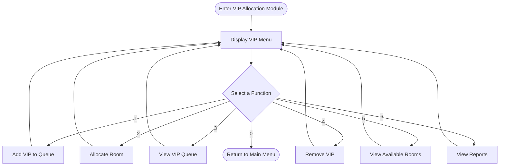
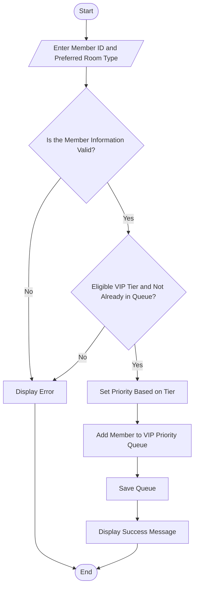
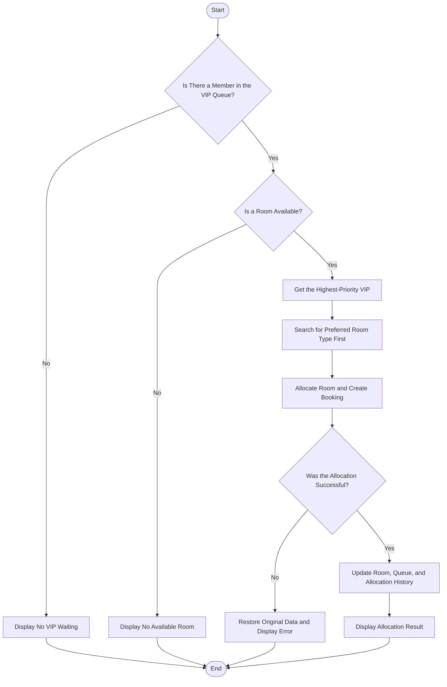
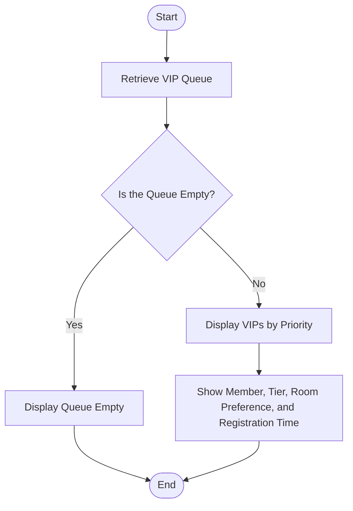
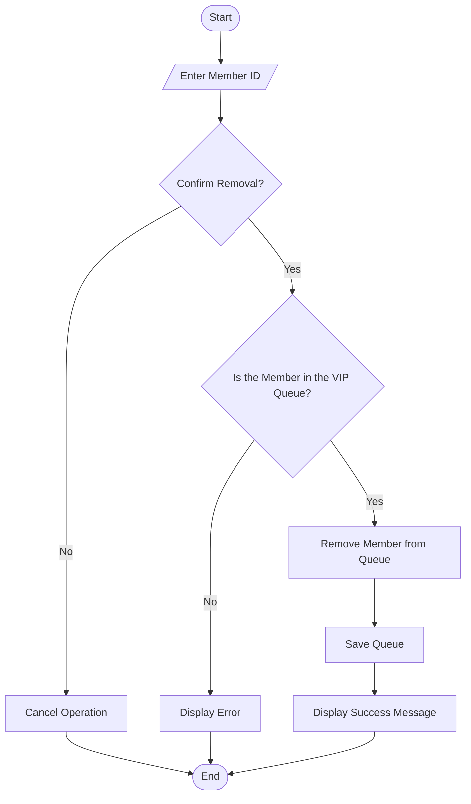
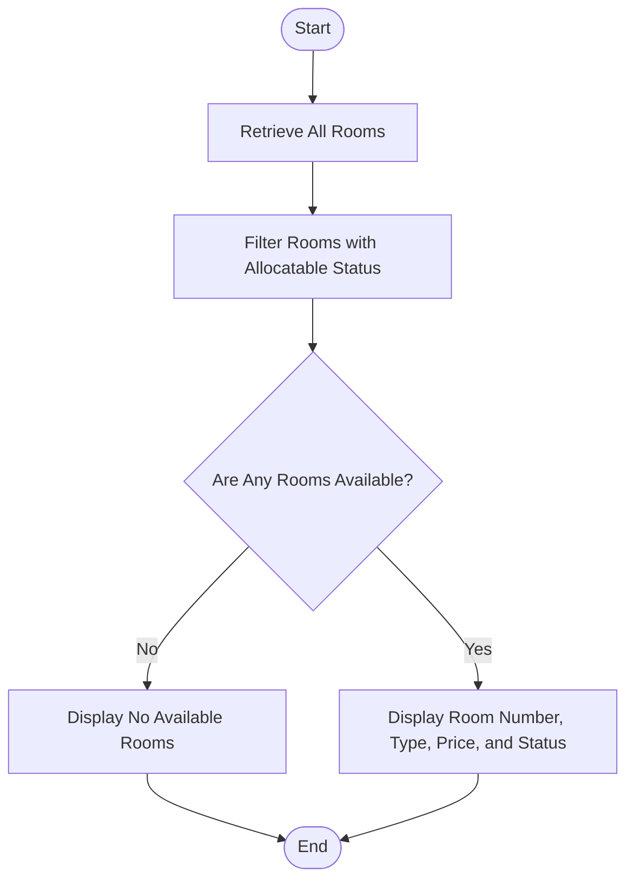
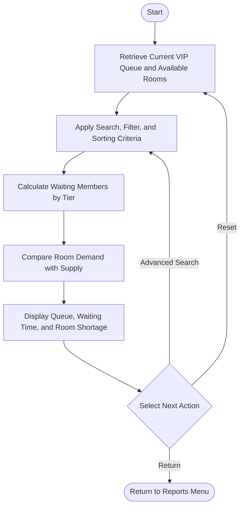
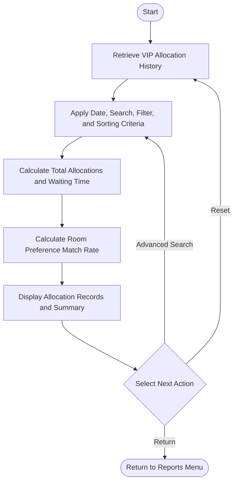

# VIP Allocation Module Flowcharts

The following flowcharts show only the main processes of each function in the VIP Allocation Module.

## 1. VIP Allocation Main Menu

## 2. Add VIP to Priority Queue

Priority order: `Platinum > Diamond > Elite`. Members in the same tier are served according to their registration time.

## 3. Allocate Room to the Next VIP

## 4. View VIP Priority Queue

## 5. Remove VIP Member

## 6. View Available Rooms

## 7. VIP Queue and Room Demand Report

## 8. VIP Allocation Performance Report

